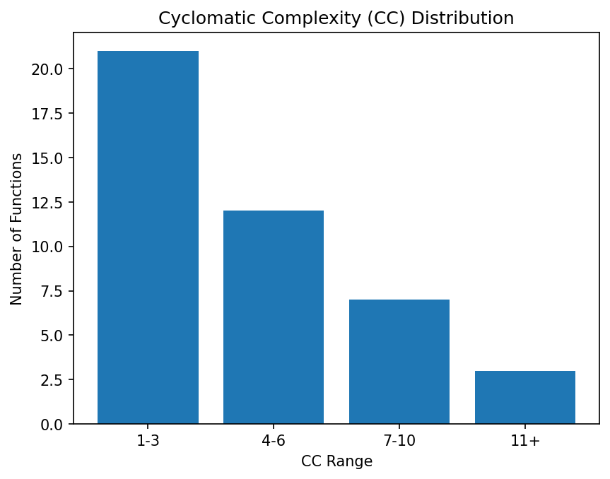
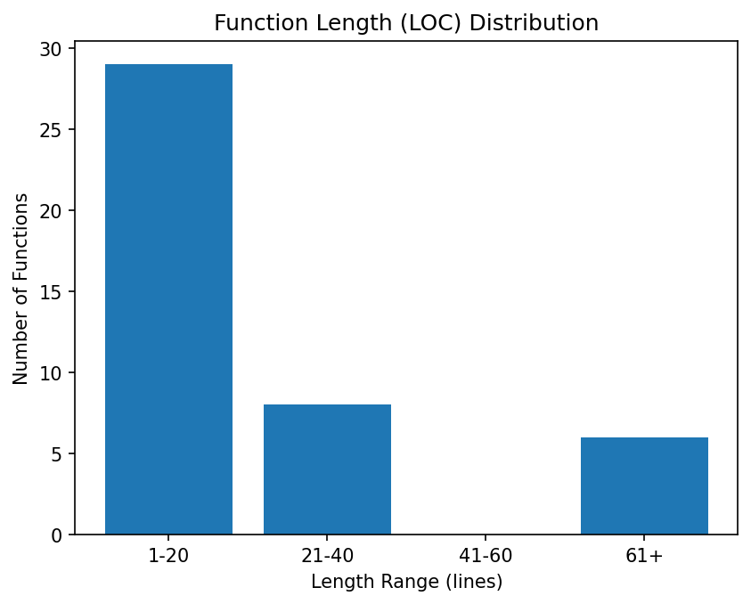
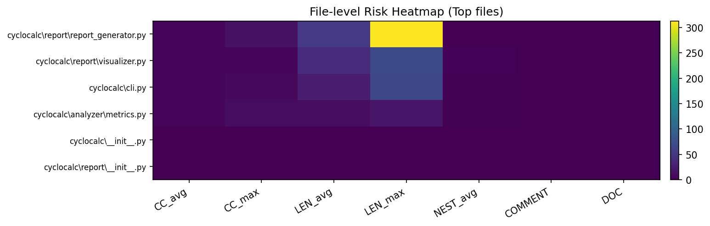

[English](README.md) | [中文](README_zh.md)


# SCP（Static Code Profiler）

**SCP** 是一个基于 AST 的 Python 静态代码分析工具。  
它能够对 Python 项目进行**多指标复杂度/质量风险剖析**，并生成图表和**交互式 HTML 报告**。

> SCP = **Static Code Profiler（静态代码剖析器）**  
> 一个轻量但实用的 Python 多指标风险分析工具。

---

## ✨ 项目亮点

- **纯静态分析**：基于 Python 内置 `ast`，不需要运行目标代码
- **多指标剖析**
  - 函数级：**CC / LEN / NEST**
  - 文件级：**注释率 / Docstring 覆盖 / 长行比例 / 命名问题比例 / 未使用导入**
- **风险分级 + 坏味道（Smells）**：Low / Medium / High
- **可视化分析**
  - CC 分布图  
  - LEN 分布图  
  - **文件级风险热力图**
- **交互式 HTML 报告**
  - Top 风险文件 & 风险函数排行  
  - Smells 列表  
  - 图表嵌入  
  - **Top 风险函数源码折叠预览**
- **工程化 CLI**
  - 阈值过滤、ignore 过滤、JSON 导出、图表/HTML 输出

---

## 📌 SCP 统计哪些指标？

### 函数级指标

| 指标 | 含义 | AST 统计口径 |
|---|---|---|
| **CC**（圈复杂度） | 分支路径复杂度，越高越易出错 | 决策节点（`if/for/while/try/except/with/...`）+ 逻辑运算 |
| **LEN**（函数长度） | 函数行数，越长越难维护 | `end_lineno - lineno + 1` |
| **NEST**（最大嵌套深度） | 控制结构嵌套层数 | 对 `If/For/While/Try/With/...` DFS 求最大深度 |

### 文件级指标

| 指标 | 含义 |
|---|---|
| **COMMENT_RATIO** | 注释行占比 |
| **DOCSTRING_COV** | 模块/类/函数 docstring 覆盖率 |
| **LONG_LINE_RATIO** | 超过 79 字符长行比例（PEP8） |
| **NAMING_ISSUE_RATIO** | snake_case / CapWords 命名违规比例 |
| **UNUSED_IMPORTS** | 未被引用的导入（语义冗余风险） |

---

## 🧠 风险等级与 Smells

SCP 将多指标映射为风险等级并输出坏味道：

- **High 风险**
  - `CC ≥ 10`  
  - `LEN ≥ 60`
  - `NEST ≥ 5`

- **Medium 风险**
  - `CC ≥ 7`
  - `LEN ≥ 40`
  - `NEST ≥ 3`
  - Docstring/注释率偏低、长行比例偏高、命名问题偏多、未使用导入

- **Low 风险**
  - 正常范围内

风险信息会在 CLI 输出与 HTML 报告中展示。

---

## 🚀 快速开始

### 1）安装依赖（Poetry）

```bash
poetry install
```

### 2）运行分析

```bash
poetry run cyclocalc <项目路径或文件> -t 5 --plots --html
```

示例：

```bash
poetry run cyclocalc cyclocalc/ -t 5 --plots --html --json output/result.json
```

---

## 🖥️ CLI 参数

```bash
cyclocalc [PATHS...] [OPTIONS]
```

| 参数 | 说明 |
|---|---|
| `-t, --threshold` | CC 阈值过滤（只显示 ≥ 阈值的函数） |
| `--plots` | 生成图表（CC/LEN 分布 + 热力图） |
| `--charts-dir` | 图表输出目录 *(默认 output/charts)* |
| `--html` | 生成交互式 HTML 报告 |
| `--html-path` | HTML 报告路径 *(默认 output/report.html)* |
| `--json` | 导出结构化 JSON 结果 |
| `--ignore` | 忽略包含指定子串的路径（可重复） |
| `--top` | HTML 中显示 Top N 风险函数 |

---

## 📊 输出说明

当使用 `--plots --html --json` 后，输出结构如下：

```
output/
 ├─ charts/
 │   ├─ cc_distribution.png
 │   ├─ len_distribution.png
 │   └─ file_heatmap.png
 ├─ report.html
 └─ result.json
```

### 报告截图

- **CC 分布图**
  
  

- **LEN 分布图**
  
  

- **文件级风险热力图**
  
  

---

## 🧩 项目结构

```
cyclocalc/
 ├─ analyzer/
 │   └─ metrics.py            # 多指标提取（AST 静态分析）
 ├─ report/
 │   ├─ visualizer.py         # 图表+热力图（matplotlib）
 │   └─ report_generator.py   # HTML 报告渲染 + smells + 源码预览
 ├─ cli.py                    # Typer 命令行入口
 └─ __init__.py
```

---

## 🔍 为什么用 Python？（也体现 SCP 的价值）

本项目充分体现 Python 在静态分析与工具开发中的优势：

- `ast` 支持编译器前端式语法解析  
- `dataclasses` + 数据结构 支撑指标建模  
- `typer` 快速构建现代 CLI  
- `matplotlib` 实现科学可视化  
- 标准库 `json/html/pathlib` 输出完整报告  

最终形成完整闭环：

**分析 → 评估 → 可视化 → 报告 → 定位风险**

---

## 🛠️ 开发与调试

本地运行：

```bash
poetry run cyclocalc cyclocalc/ -t 5
```

（如果后续补充测试）运行：

```bash
poetry run pytest
```

---

## 🧭 可选后续扩展

- 增加更多语义 smells（如 broad except、可变默认参数）
- 历史对比分析（`--compare old.json new.json`）
- HTML 表格支持排序/搜索过滤

---

## 🙏 致谢

- 基于开源项目 **CycloCalc**（Typer CLI + CC 统计）进行扩展  
- 我们在其基础上新增多指标评估、风险分级、可视化与交互报告

---

## 📄 License

GPL-2.0-only
